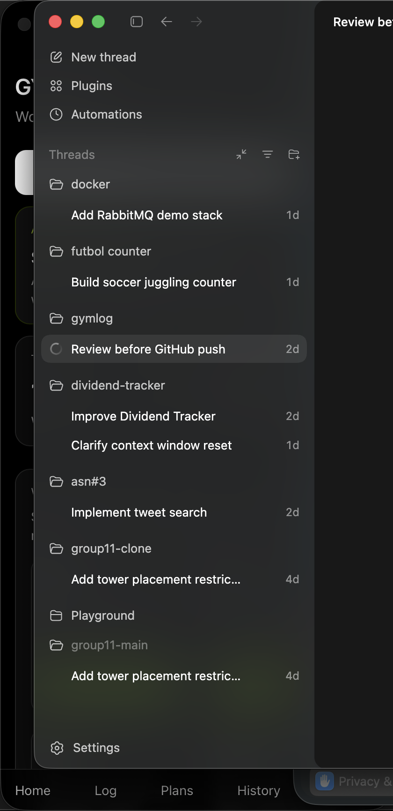
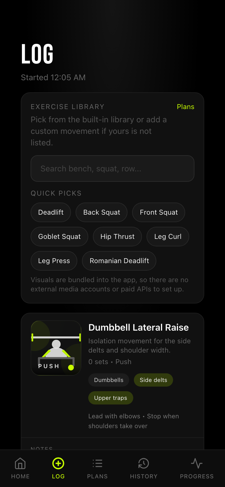
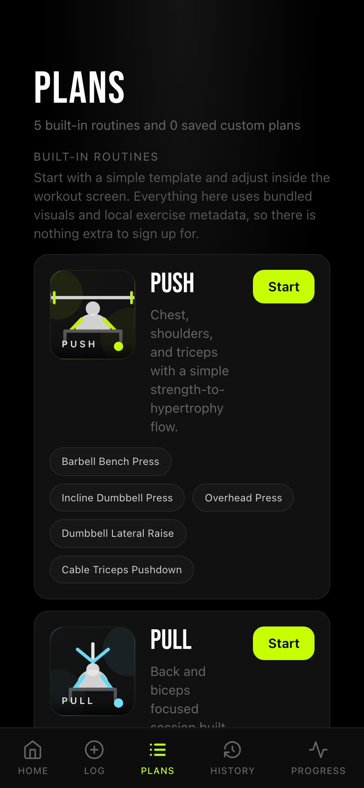
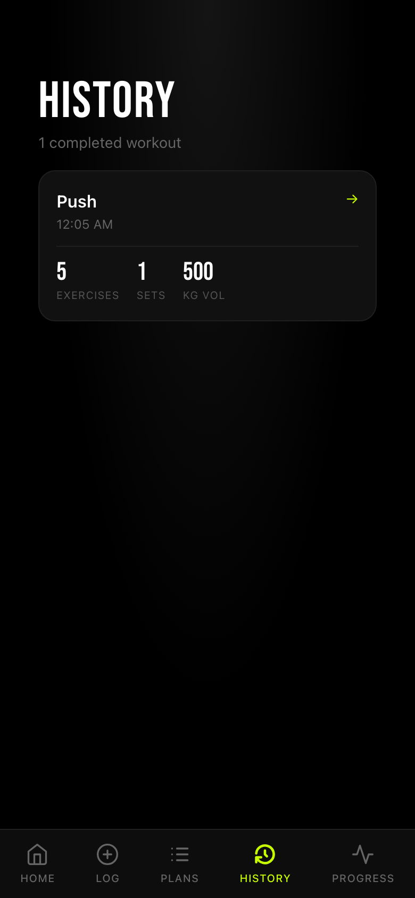

# GymLog

GymLog is a mobile-first workout tracker for logging lifting sessions, reviewing workout history, and tracking exercise progress over time.

It is built with Next.js, TypeScript, Prisma, and PostgreSQL, with account login and a guest mode so you can try the app quickly without sharing one global demo user.

## Live Demo

[https://gymlog-seven.vercel.app](https://gymlog-seven.vercel.app)

The live deployment supports both account creation and guest sessions. It is still best treated as a portfolio demo rather than a place for sensitive personal data.

## Screenshots

<p align="center">
  
  
  
  
</p>

## What It Demonstrates

- Full-stack Next.js App Router architecture
- Authentication with account creation and guest sessions
- Server actions for write-heavy workout logging flows
- Relational data modeling with Prisma and PostgreSQL
- Mobile-first UI for fast in-session logging
- Reusable workout plans and an exercise library with custom exercise support

## Features

- Start and continue an active workout session
- Create an account or continue as a guest from the landing page
- Add exercises while you train
- Pick from a built-in exercise library instead of typing every movement manually
- Add a custom exercise if it does not exist in the library
- Log sets with weight and reps
- Save per-exercise notes, cues, or machine settings
- Delete sets if you make a mistake
- Finish workouts and save them to history
- Review completed sessions with exercise count, set count, and total volume
- Open a workout to see the full exercise-by-exercise set breakdown
- Track progress for individual exercises
- See best set, best estimated 1RM, and best estimated 1RM in the last 30 days
- Start from built-in workout plans like Push, Pull, Legs, Upper, and Lower
- Create and save custom workout plans
- Browse bundled exercise visuals, muscle tags, equipment info, and quick cues
- Use a mobile-first interface designed for quick logging during training

## Stack

- Next.js 14 App Router
- TypeScript
- Tailwind CSS
- Prisma
- PostgreSQL

## Technical Highlights

- Uses server actions for starting workouts, adding exercises, logging sets, saving notes, and creating plans
- Models users, sessions, exercises, sets, session-specific notes, and workout plans with Prisma relations
- Uses Auth.js credentials sessions for account login and isolated guest access
- Seeds a reusable exercise library and built-in workout templates for a fast first-run experience
- Keeps media simple with bundled SVG exercise visuals instead of third-party image APIs or paid services
- Supports both structured library exercises and user-defined custom exercises in the same logging flow
- Keeps user-created exercises tied to the account or guest session that created them

## Current Scope

- This version supports account login and guest access, but does not yet include advanced auth features like password reset or OAuth providers
- Workout data is stored in PostgreSQL through Prisma
- The app is strongest as a portfolio/demo project that shows full-stack implementation and product thinking

## Local Setup

Recommended runtime: Node.js 20 LTS.

This repo includes an `.nvmrc` file, so if you use `nvm`:

```bash
nvm install 20
nvm use 20
```

Then install dependencies:

```bash
npm install
```

## PostgreSQL Setup

Example setup on macOS with Homebrew:

```bash
brew install postgresql@16
brew services start postgresql@16
createdb gymlog
```

## Environment Variables

Create a local env file:

```bash
cp .env.example .env
```

Default local database connection:

```env
DATABASE_URL="postgresql://<your_user>@localhost:5432/gymlog"
AUTH_SECRET="<generate-a-32-byte-secret>"
```

Replace `<your_user>` with your macOS username.

## Run The App

Apply the database schema and seed the exercise library:

```bash
npx prisma migrate dev --name init
npx prisma db seed
```

Start the dev server:

```bash
npm run dev
```

Open [http://localhost:3000](http://localhost:3000).

## Use It On Your Phone

If your phone and laptop are on the same Wi-Fi network, you can open the app from your phone browser.

Start the dev server so it listens on your network:

```bash
npm run dev -- --hostname 0.0.0.0
```

Then find your laptop's local IP address:

```bash
ipconfig getifaddr en0
```

On your phone, open:

```text
http://YOUR_LOCAL_IP:3000
```

If you want it to feel more app-like, add it to your home screen from Safari or Chrome.

## Project Notes

- The app supports both accounts and guest sessions.
- Workout data is stored in PostgreSQL through Prisma.
- Prisma migrations are stored in `prisma/migrations`.

## Scripts

```bash
npm run dev
npm run build
npm run start
npm run lint
```
